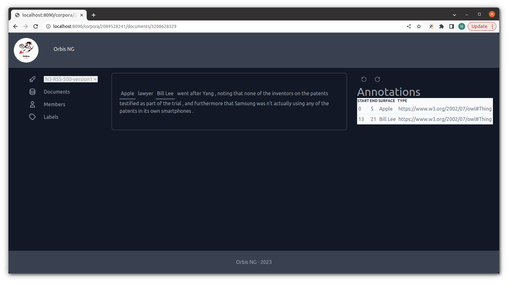

# Orbis Annotator / Orbis 2 Frontend

Orbis Annotator provides a user-friendly, easy to install, web-based software that supports users in efficiently annotating language data. It supports standard and collaborative workflows, reuse of language resources through corpus versioning, and provides built-in tools for assessing corpus quality. 

- [Install and use Orbis Annotator](#install-and-use-orbis-annotator)
- Developer information on the [Orbis Annotator Frontend](#orbis-annotator-frontend)
- Developer information on the [Orbis Annotator Backend](https://github.com/orbis-eval/orbis2-backend)

The Orbis 2 Frontend project hosts the Orbis vuejs application, that can be deployed together with the [Orbis 2 backend]. 

The section below describes how you can easily use Orbis2 for your 


## Install and use Orbis Annotator

The [Orbis2 Docker Container](https://github.com/orgs/orbis-eval/packages/container/package/orbis2-frontend) bundles all software necessary to run Orbis Annotator.

### Start the container

Start and run the container with the following command.
```bash
docker run --name orbis2-frontend -p 8090:8090 \
   -e PGDATA=/var/lib/postgresql/data/pgdata \
   -v orbis-data:/var/lib/postgresql/data \
    ghcr.io/orbis-eval/orbis2-frontend:latest
```

The Postgres database password (required for database backups) will be automatically generated during the container's first startup and printed to the console. All databases and data is stored in the `orbis-data` volume. If you prefer to save the data in a local directory, replace `orbis-data` with its full path (e.g., `/home/albert/orbis-data`).

Once startup has completed you can access Orbis Annotator under the URL http://localhost:8090/.



###  Import existing corpora into Orbis Annotator

You can use the Orbis importer tool for importing corpora into Orbis annotator.

#### Importing a local corpus


#### Importing a remote corpus

Obtain a list of all available remote corpora:
```
docker exec -e PYTHONPATH=/orbis-backend/src orbis2-frontend /orbis-backend/scripts/importer.py list-remote
```


Import a specific corpus (e.g., corpus **N3-RSS-500** with run name **N3-RSS-500-version1**). The run name refers to the name of the AnnotatedCorpus (i.e., the corpus and the corresponding annotations)
```
docker exec -e PYTHONPATH=/orbis-backend/src orbis2-frontend /orbis-backend/scripts/importer.py remote N3-RSS-500 N3-RSS-500-version1
```

Please refer to the [Orbis2 Backend Documentation](https://github.com/orbis-eval/orbis2-backend) for a more detailed documentation on the Orbis 2 import tool.


### Backup all Orbis data

You can create a backup of the Orbis Postgres database by running the following command, replacing `[password]` with the Postgres password printed at first container startup.
```bash
docker exec -i -e PGPASSWORD=[password] orbis2-frontend /bin/bash -c "pg_dump --username postgres orbis" > backup.sql
```


## Orbis Annotator Frontend

The following information is intended for developers who want to run the Orbis 2 frontend component on their development platforms.

### Setup

Make sure to install the dependencies:
```bash
# yarn
yarn
```
We use yarn instead of npm, its faster and has better security features. Further, the pinia framework could not be installed properly with npm.
IMPORTANT: don't mix npm and yarn, since this could lead to wrong dependencies.

### Development

Start the development server on http://localhost:3000

```bash
yarn run dev
```

all used icons can be found under https://oh-vue-icons.js.org/

### Production

Build the application for production:

```bash
yarn run build
```

Locally preview production build:

```bash
yarn run preview
```

Check out the [deployment documentation](https://nuxt.com/docs/getting-started/deployment) for more information.


### Vue Hero Icons
Installed with 
```
yarn add @heroicons/vue
```


